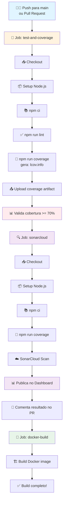
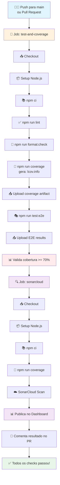
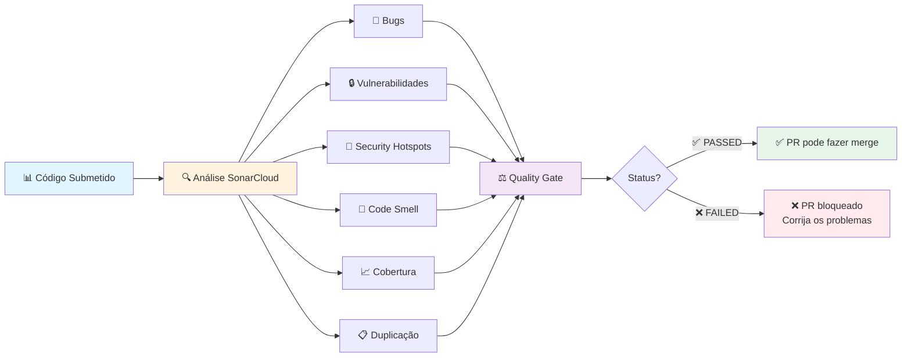
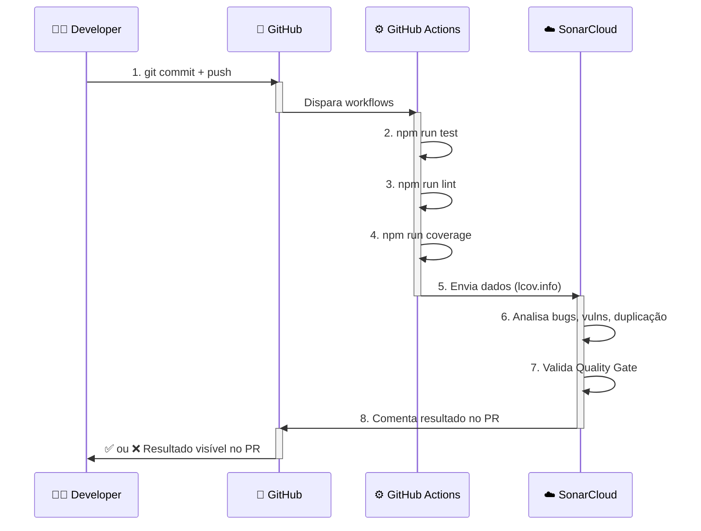

# 📊 Fluxo CI/CD Completo - Price-Watch

## Backend: Deploy Backend Docker



## Frontend: Quality Checks



## SonarCloud: Detalhes da Análise



## Fluxo Semanal do Desenvolvedor



## Métricas Monitoradas

| Métrica | Backend | Frontend | Ferramenta |
|---------|---------|----------|-----------|
| **Code Coverage** | 70-80% | 70-80% | Vitest + lcov |
| **Bugs** | A (excelente) | A (excelente) | SonarCloud |
| **Vulnerabilities** | 0 | 0 | SonarCloud |
| **Code Smells** | Low | Low | SonarCloud |
| **Duplicated Lines** | < 3% | < 3% | SonarCloud |
| **Lint Errors** | 0 | 0 | ESLint |
| **Format Issues** | 0 | 0 | Prettier |
| **E2E Tests** | N/A | ✅ Pass | Playwright |

## Timeline de Verificação

```
┌─────────────────────────────────────────────┐
│  Sua Push / PR no GitHub                     │
└─────────────────┬───────────────────────────┘
                  │
          ┌───────▼────────┐
          │ 5-10 segundos  │ GitHub Actions inicia
          └───────┬────────┘
                  │
    ┌─────────────┼─────────────┐
    │             │             │
    ▼             ▼             ▼
  Testes      ESLint        Coverage
   2-5s        1-2s            1-2s
    │             │             │
    └─────────────┼─────────────┘
                  │
          ┌───────▼────────┐
          │ 30-60 segundos │ SonarCloud scan
          └───────┬────────┘
                  │
    ┌─────────────▼─────────────┐
    │ Resultado comentado no PR  │
    │ (Total: ~1-2 minutos)      │
    └───────────────────────────┘
```

## Exemplo de Comentário no PR

```
✅ Quality Gate PASSED

Coverage: 78% (target: 70%)
Maintainability Rating: A
Reliability Rating: A
Security Rating: A

🐛 Bugs: 0
🔒 Vulnerabilities: 0
🔐 Security Hotspots: 0
💾 Code Smells: 2
📋 Duplicated Lines: 0.5%

You can merge this PR! ✨
```

## Dashboard SonarCloud

```
pricewatch-backend
├─ Quality Gate: ✅ PASSED
├─ Coverage: 78%
├─ Maintainability: A
├─ Bugs: 0
├─ Vulnerabilities: 0
└─ Last Analysis: 5 minutes ago

pricewatch-frontend
├─ Quality Gate: ✅ PASSED
├─ Coverage: 75%
├─ Maintainability: A
├─ Bugs: 1 (medium)
├─ Vulnerabilities: 0
└─ Last Analysis: 5 minutes ago
```

---

**Próxima etapa:** Configure SONAR_TOKEN no GitHub para que tudo funcione automaticamente!
